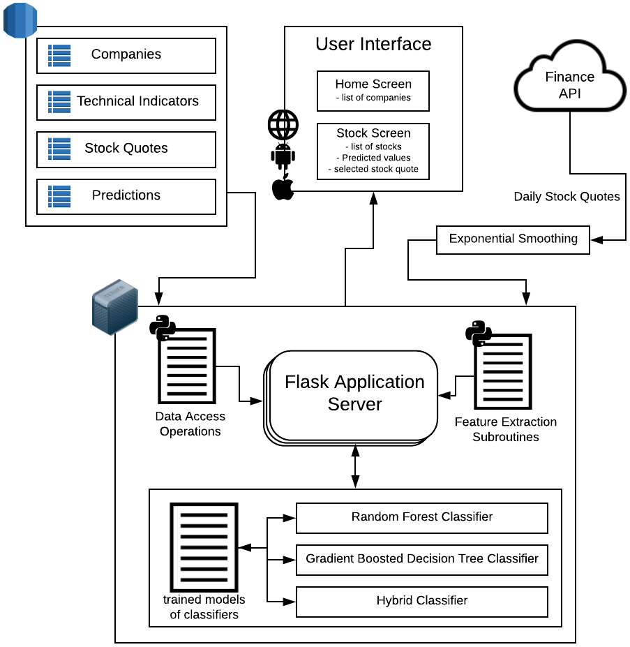

<p align="center">

</p>

## [<p align="center"></p>]()

# About

The stock market is ever-changing and constantly fluctuating. This makes it
impossible for a person, even an expert, to predict. The Stock Analysis Application aims
to combat this problem. Our application will be used by traders and investors in order to
view predictions of directions of stock market prices for various companies.
<br/><br/>

<center></center>
<br/><br/>
The Stock Analysis Application provides an accurate indication on whether the price
of stock will rise or fall. It has features such as real time data updates, predictions which
are evaluated daily and a list of many companies to choose from. The API is a restful api allowing for interaction with cross-platform applications.

---

# Development

## Requirements

- [Python 3.6+](https://www.python.org/downloads/)
- [heroku CLI](https://devcenter.heroku.com/articles/heroku-cli)
- [MySQL 5.6+ community edition](https://dev.mysql.com/downloads/mysql/5.6.html)

## Setting up development environment

```
> git clone https://github.com/team31-pesitbsc/stock-analysis-application-services
> cd stock-analysis-application-services
> pip install -r requirements.txt
```

## Setting up a local database

- Create a database named **stock** in your local MySQL database
- Create the schema for the stock database by running the commands present in [DDL.sql](https://github.com/team31-pesitbsc/stock-analysis-application-services/blob/master/db/DDL.sql)
- Load the database with dummy data using the commands present in [DML.sql](https://github.com/team31-pesitbsc/stock-analysis-application-services/blob/master/db/DML.sql)

## Running the server locally

```
> heroku local web -f Procfile.windows
```

---

# License

This project is licensed under the MIT License - see the [LICENSE](LICENSE) file for details
